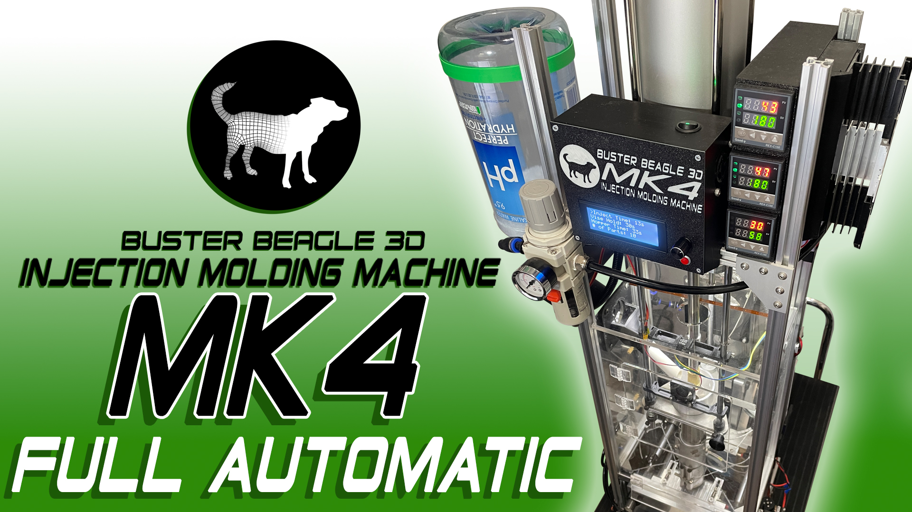
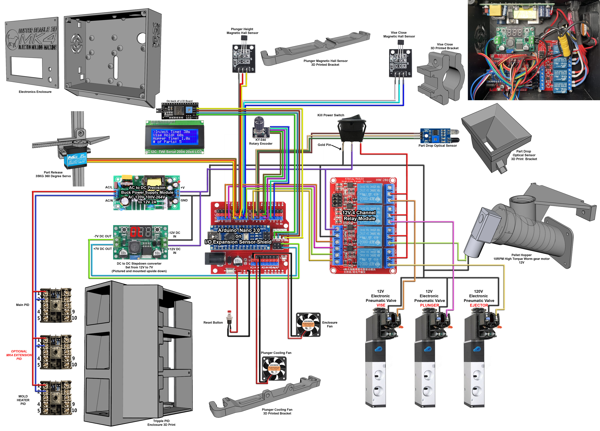
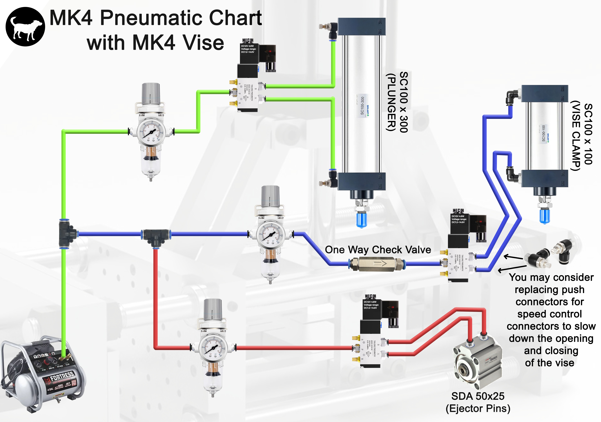

# Buster Beagle 3D MK4 Injection Molding Machine
Watch the [video](https://youtu.be/S4sWyfVj5go) where I go over how the MK4 machine works. 

## Buster Beagle 3D on YouTube. 
Many of these videos give you a better understanding of the evolution of this machine and might clear any questions on how it works and how to build it. 
- [MK1 Injection Molding Machine](https://youtu.be/HoSVPHVESiE), The original and smaller hand crank desktop version.
- [MK2 Injection Molding Machine](https://youtu.be/JqHPNjSaw4w), The upgraded version of the MK1 with a larger 2 Cubic inch shot volume.
- [MK3 Injection Molding Machine](https://youtu.be/PvQU3Q8wwOU), The first vesion of the machine to introduce pneumatics, also increased volume to 3 Cubic Inches.
- [MK4 Chamber and Vise Upgrades](https://youtu.be/dzYe9b0Iuzc), Talks about the first upgrades that convert an MK3 to and MK4 machine.

#### Other related videos dealing with Buster Beagle 3D injection molding machines
- [3D PRINTED MOLDS](https://youtu.be/qJnGCyYruQ8), Process of turning an STL into a 3D printed mold
- [FIBER LASER ENGRAVED INJECTION MOLDS](https://youtu.be/bhsx4LF5uKI), Using a 20W fiber laser to create an Aluminum Mold. 
- [MK1 Machine in action](https://youtu.be/hsnGJBuQnsQ), Shows the working of the original MK1 Machine
- [MK1 in Action Zoomed out](https://www.youtube.com/watch?v=FbLRaO-yq1Y), Another version but more zoomed out.
- [Cutting Aluminum Molds on a 3018 CNC](https://youtu.be/Yb_kre3Zwz0), Making molds with a hobby CNC Machine
- [Recycling Plastic At Home](https://youtu.be/mXXFwO77XmE), Breaking down 3D prints and bottles for use in the machines.
- [Heating Chamber Cleaning](https://youtu.be/_xt9IpcRtrc), Easy method to clean out the injection Molding chambers.
- [MK2 Updates with PID Tuning](https://youtu.be/1GWBhMkB2vM), MK2 Updates as well as instructions for tuning the Rex PID Controller.
- [Semi-Automatic version of the MK3 Machine](https://youtu.be/W7IDYLqGYVA), Semi Auto version of the machine where you can set an timed injection. 

# Ardunio
You can find the arduino code for the project in the `/MK4_Automation` directory

## Libraries needed

All these libraries can be easily installed using the Arduino IDE library manager.
- `Encoder` by Paul Stoffregen.
- `Wire` by Arduino.
- `LiquidCrystal_I2C` by Frank de Brabander.
- `avr/wdt` by AVR Libc.
- `Servo` by Arduino.

## MK4 BOM
- You can find the full BOM of the parts needed [HERE](https://docs.google.com/spreadsheets/d/1JVG8-Zt6J-UAuxbnEOaoJAQSUpH0-k1IP8Y7-RxV8Eo/edit?usp=drive_link)
- For the Buster Beagle 3D parts [CLICK HERE](https://www.busterbeagle3d.com/) 

## 3D Printed Parts
Chceck on the `/3D_Prints` directory for parts.

## MK3/MK4 frame PDF file
[MK3/MK4 Frame Build](https://drive.google.com/file/d/1zg0rRujJQF1wtNAtguwyY8d_fwCQzAzu/view?usp=drive_link) Frame for the MK3 and MK4 builds are the same. 
- The only difference would be the exclusion of the manual pneumatic button as well as longer upright aluminum extrusion, 10mm linear rods holding the triangle plate, and pnuematic cylinder if building the MK4 with the optional extension chamber. 

## MK4 Vise 
#### [Purchase Vise Here](https://www.busterbeagle3d.com/product/aluminum-pneumatic-vise-kit/34?cs=true&cst=custom)
- [MK4_Vise_Assembly PDF](https://drive.google.com/file/d/12hUAGlBEdqDP5q_SxHw-1Td8OqxFoPMN/view?usp=drive_link)
- [MK4 Vise Assembly Video](https://youtu.be/MoHPu2ggeWM)
- [MK4 Mold template](https://drive.google.com/file/d/1ILh0e-uNvjLMUA351t_ClR8Q0iGrUpfI/view?usp=drive_link) This is a mold template used to creat your own molds to fit onto the MK4 Vise. 

## MK4 Wiring Diagram

## MK4 Pneumatics Diagram

